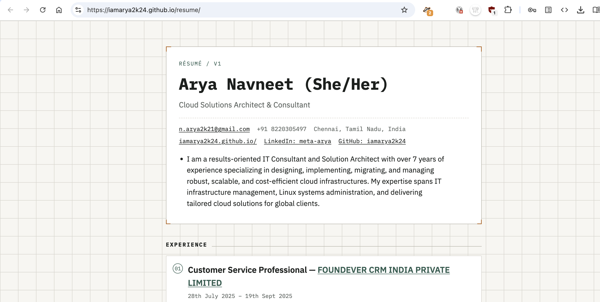

# Résumé Site

Single-page résumé, statically hosted on GitHub Pages. Content lives in one file (`resume.yaml`); the page fetches and renders it client-side. No build step, no npm, no framework.


## Preview



> Screenshot not included in this scaffold. Add your own after deploying — see [Adding the screenshot](#adding-the-screenshot).

## How it works

1. `index.html` loads on request.
2. JavaScript in that file fetches `resume.yaml` and parses it with [`js-yaml`](https://github.com/nodeca/js-yaml) (loaded from a CDN).
3. The parsed data is rendered into the DOM — header, experience, projects, skills, education, certificates.
4. `styles.css` applies the visual design (light/dark via `prefers-color-scheme`, responsive layout, print styles).

Editing content never touches HTML, CSS, or JS — only `resume.yaml`.

## File structure

```
your-repo/
├── index.html      # markup + fetch/parse/render logic
├── styles.css       # all styling
├── resume.yaml       # all content — edit this to update the résumé
└── README.md
```

## Local development

No server-side code, but `fetch()` requires the page to be served over HTTP (not opened as a `file://` URL). Any static server works:

```bash
# Python
python3 -m http.server 8000

# Node (if installed)
npx serve .
```

Then open `http://localhost:8000`.

## Editing content

Everything is in `resume.yaml`. Top-level keys:

| Key | Purpose |
|---|---|
| `basics` | Name, headline, contact info, location, profile links, summary |
| `experience` | List of jobs — `company`, `position`, dates, `highlights`, `tags` |
| `projects` | List of projects — `name`, `description`, `url`, `tags` |
| `skills` | List of `{ category, items }` groups |
| `education` | List of `{ institution, degree, area, startDate, endDate }` |
| `certificates` | List of `{ name, issuer, date, url }` |

Any section can be omitted or left as an empty list — the renderer skips sections with no data. `endDate` left blank renders as "Present".

## Deployment (GitHub Pages)

```bash
git init
git add .
git commit -m "Initial resume site"
git branch -M main
git remote add origin https://github.com/<username>/<repo>.git
git push -u origin main
```

Then in the repo:

1. **Settings → Pages**
2. Source: **Deploy from a branch**
3. Branch: `main`, folder: `/ (root)`
4. Save

Site goes live at `https://<username>.github.io/<repo>/`, usually within a minute.

To update content after that: edit `resume.yaml`, commit, push. No rebuild step.

## Adding the screenshot

1. Deploy the site (above).
2. Open it in a browser at a reasonable width (~1280px) and take a screenshot.
3. Save it as `docs/screenshot.png` in the repo.
4. Commit and push — it will render in this README on GitHub.

```bash
mkdir -p docs
# save your screenshot to docs/screenshot.png
git add docs/screenshot.png
git commit -m "Add site screenshot"
git push
```

## Custom domain (optional)

1. Add a `CNAME` file to the repo root containing your domain, e.g.:
   ```
   resume.yourdomain.com
   ```
2. At your DNS provider, add a `CNAME` record pointing `resume` (or your chosen subdomain) to `<username>.github.io`.
3. In **Settings → Pages**, enter the custom domain and enable **Enforce HTTPS** once the certificate provisions.

## License

MIT — use, modify, and redeploy freely.
